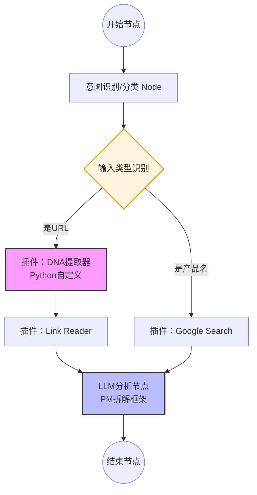

# AI 产品深度拆解助手：可视化工作流设计

为了让你更清晰地理解整个智体的运行逻辑，我为你设计了如下流程图。你可以直接参考这个结构在 Coze 的 `Workflow` 页面进行搭建。

## 流程节点详解

1. **开始节点 (Start)**: 接收用户输入的 `product_query` (网址或名称)。
2. **意图识别 (Intent)**: 这是一个简单的 LLM 节点，用于判断输入是 `URL` 还是 `Product Name`。
3. **选择器 (Selector)**: 根据意图识别的结果，走不同的分支。
4. **DNA 提取器 (DNA Extractor)**: **这就是我们要用 Python 自主开发的插件**。它负责抓取网页源码，提取 SEO、社交链接和技术栈等“底层基因”。
5. **Link Reader**: 辅助读取网页的具体正文文案，补充 DNA 提取器无法覆盖的描述信息。
6. **Google Search**: 如果用户只输入了名称，则通过搜索获取相关背景。
7. **LLM 分析 (Analysis)**: 这是最核心的“大脑”节点，汇总所有原始数据，套用 PM 分析框架进行深度拆解。
8. **结束节点 (End)**: 将分析结果以精美的 Markdown 报告形式返回给用户。
